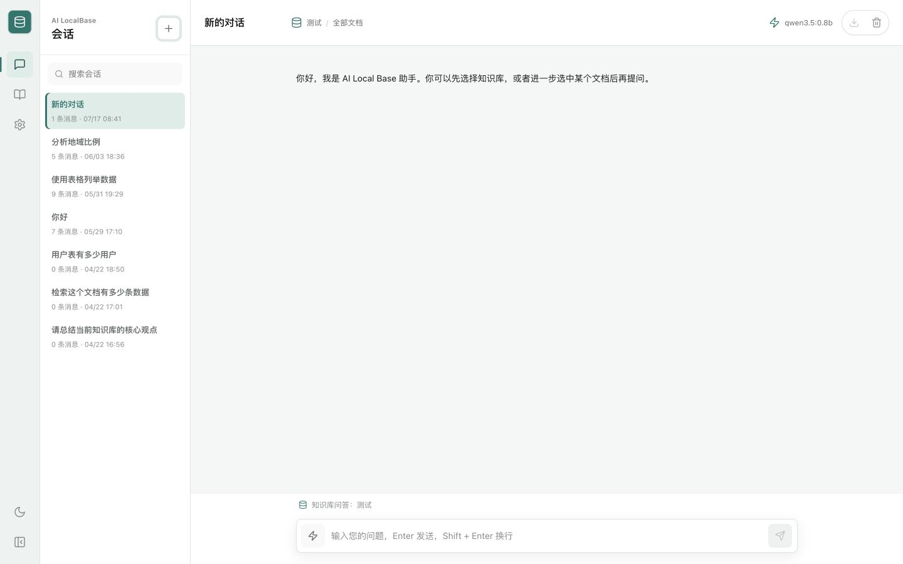
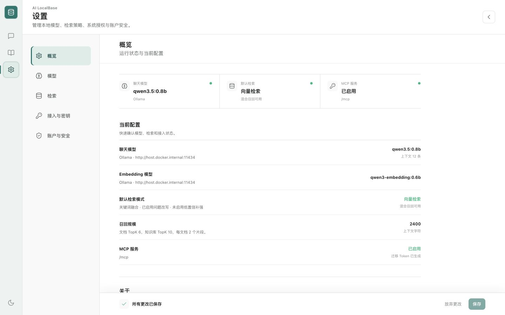
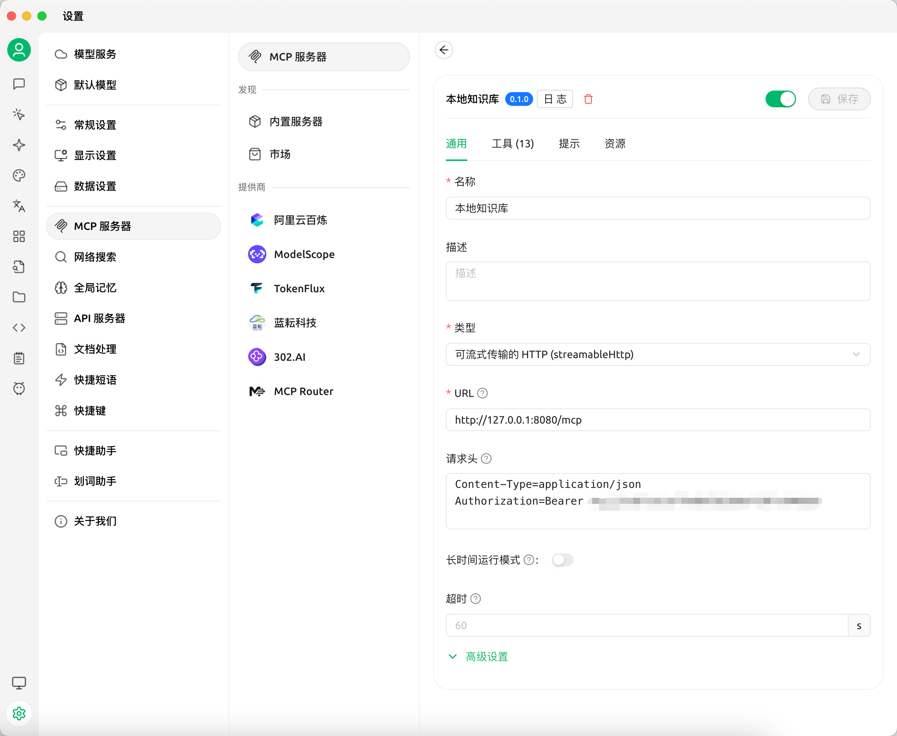
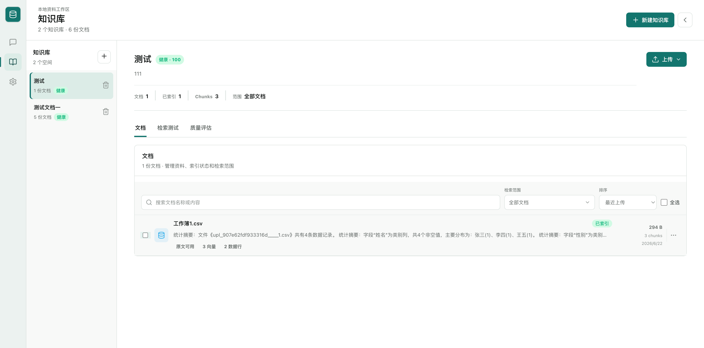
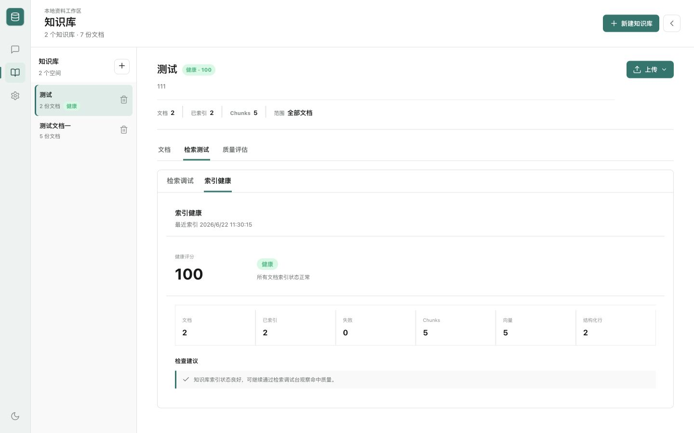
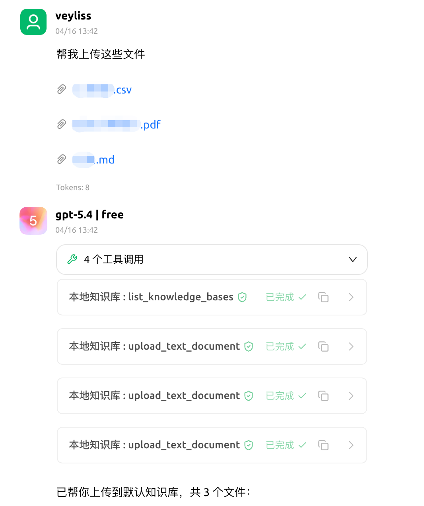
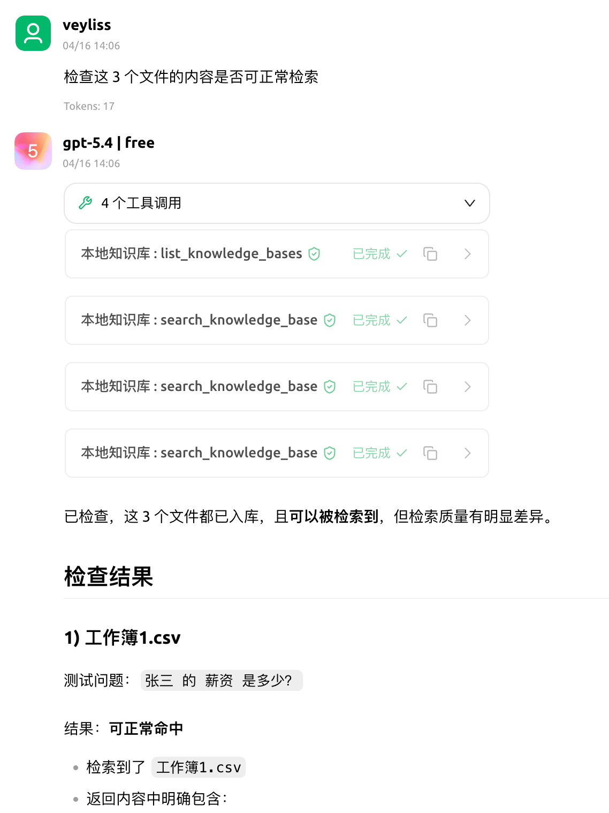

# AI LocalBase

一个本地优先的 AI 知识库系统（RAG），用于将本地文档接入向量检索与大模型对话流程。项目提供 Web UI，支持知识库管理、文档上传、检索增强问答、聊天记录持久化，以及基于 Ollama 或 OpenAI 兼容接口的模型接入。



## 项目简介

AI LocalBase 适合个人或小团队在本地环境、自托管环境中快速搭建可用的知识库问答系统。

- 后端：Go + Gin
- 前端：React + Vite + TypeScript
- 向量数据库：Qdrant
- 模型接入：Ollama / OpenAI Compatible API
- 部署方式：本地启动 / Docker Compose
- 扩展能力：内置 MCP Server，可供外部 Agent / 工具系统接入

---

## 核心能力

- 知识库管理：创建、删除知识库，查看文档列表
- 文档上传与索引：支持 TXT、Markdown、PDF、xlsx、csv 文件上传与解析
- 检索增强问答：基于 Qdrant 做向量检索并把命中内容注入对话上下文
- 聊天记录持久化：会话消息保存到本地 SQLite 数据库
- 配置持久化：模型配置与知识库状态保存到本地 JSON 文件
- Docker Compose 部署：支持一键拉起前端、后端、Qdrant

### 检索增强能力

- 文本自动切分与批量嵌入
- 候选结果动态召回
- 关键词覆盖增强重排
- MMR 去冗余选择
- 低置信度场景二次扩召回
- 嵌入缓存与可选语义缓存
- 可选 Hybrid Search、Semantic Reranker、Query Rewrite、Context Compression

---

## 适用场景

- 本地个人知识库
- 团队内部文档问答
- 自托管 RAG 原型验证
- Ollama / OpenAI 兼容模型接入测试
- 检索策略实验与评估
- 作为 MCP 能力后端供 Agent 调用

---

## 快速开始

最短体验路径：

1. 启动 Qdrant：

```bash
docker compose -f docker-compose.qdrant.yml up -d
```

2. 启动后端：

```bash
cd backend
go run .
```

3. 启动前端：

```bash
cd frontend
npm install
npm run dev
```

4. 打开 `http://localhost:5173`，进入设置页配置 Chat 与 Embedding 模型。

如需更完整的命令、环境变量与接口说明，请查看 [`docs/getting-started.md`](docs/getting-started.md)。

---

## 部署方式

### 本地开发启动

适合日常开发、调试接口、修改前端页面。

1. 启动 Qdrant：

```bash
docker compose -f docker-compose.qdrant.yml up -d
```

2. 启动后端：

```bash
cd backend
go run .
```

3. 启动前端：

```bash
cd frontend
npm install
npm run dev
```

默认地址：

- 前端：`http://localhost:5173`
- 后端：`http://localhost:8080`
- Qdrant：`http://localhost:6333`

### Docker Compose 一键启动

适合快速体验或自托管部署验证。

```bash
docker compose up --build
```

默认服务地址：

- 前端：`http://localhost:4173`
- 后端：`http://localhost:8080`
- Qdrant HTTP API：`http://localhost:6333`
- Qdrant gRPC：`localhost:6334`

### 使用预构建镜像部署

如果不想本地编译，可直接使用预构建镜像：

```bash
docker compose -f docker-compose.prod.yml up -d
```

更多镜像、版本与部署细节见 [`DOCKER_DEPLOY.md`](DOCKER_DEPLOY.md)。

### 仅启动应用编排

如果希望单独使用应用编排文件，也可以执行：

```bash
docker compose -f docker-compose.app.yml up --build
```

---

## 设置页面配置

### 设置页面



打开前端后，进入 Settings 页面，分别配置 Chat 与 Embedding。

### Ollama 示例

**Chat 配置**

- Provider: `ollama`
- Base URL: `http://localhost:11434`
- Model: `qwen2.5:7b` 或 `llama3.2`
- API Key: 留空

**Embedding 配置**

- Provider: `ollama`
- Base URL: `http://localhost:11434`
- Model: `bge-m3` 或 `nomic-embed-text`
- API Key: 留空

### OpenAI Compatible 示例

**Chat 配置**

- Provider: `openai`
- Base URL: 你的兼容接口地址，例如 `https://your-api.example.com/v1`
- Model: 对应聊天模型名
- API Key: 对应访问密钥

**Embedding 配置**

- Provider: `openai`
- Base URL: 你的兼容接口地址
- Model: 对应嵌入模型名
- API Key: 对应访问密钥

---

## MCP 支持

项目内置基础 MCP Server 能力，作为后端内嵌工具服务运行，可供外部 Agent、脚本或工具系统通过 HTTP / JSON-RPC 接入。

当前支持：

- HTTP 形式 MCP 入口
- 工具列表发现能力
- 只读 / 写入 / 危险工具权限分级
- Bearer Token 鉴权
- 限流、超时与审计日志
- 危险工具二次确认机制
- 复用现有知识库、会话、配置与检索服务

默认入口：

- `GET /mcp`
- `GET /mcp/tools`
- `POST /mcp`

常用环境变量：

- `ENABLE_MCP`：是否启用 MCP，默认 `true`
- `MCP_BASE_PATH`：MCP 挂载路径，默认 `/mcp`
- `MCP_REQUEST_TIMEOUT_SECONDS`：请求超时，默认 `15`
- `MCP_REQUESTS_PER_MINUTE`：每分钟限流，默认 `120`

### Cherry Studio 接入示例

如果你希望在 Cherry Studio 中通过 MCP 接入 [`AI LocalBase`](README.md)，可以按以下方式配置：

- **类型**：可流式传输的 HTTP（`streamableHttp`）
- **URL**：`http://127.0.0.1:8080/mcp`
- **请求头**：
  - `Content-Type: application/json`
  - `Authorization: Bearer <你的 MCP Token>`




更完整的方法、工具列表、鉴权与调用示例见 [`docs/mcp.md`](docs/mcp.md)。

---

## 界面预览

### Demo 演示

<p align="center">
  
  
</p>
<p align="center">
  
  
</p>
---

## 文档导航

- 快速开始与使用指南：[`docs/getting-started.md`](docs/getting-started.md)
- 系统架构：[`docs/architecture.md`](docs/architecture.md)
- MCP 说明：[`docs/mcp.md`](docs/mcp.md)
- 检索优化计划：[`docs/retrieval-improvement-plan.md`](docs/retrieval-improvement-plan.md)
- Docker 镜像与部署指南：[`DOCKER_DEPLOY.md`](DOCKER_DEPLOY.md)
- 故障排查：[`TROUBLESHOOTING.md`](TROUBLESHOOTING.md)

---

## 项目结构

```text
ai-localbase/
├── backend/
├── frontend/
├── docs/
├── docker/
├── assets/
├── docker-compose.yml
├── docker-compose.qdrant.yml
├── docker-compose.app.yml
└── docker-compose.prod.yml
```

更完整的系统结构、模块职责与接口设计见 [`docs/architecture.md`](docs/architecture.md)。

---

## 开源协作

- License：[`LICENSE`](LICENSE)
- 贡献指南：[`CONTRIBUTING.md`](CONTRIBUTING.md)
- 安全策略：[`SECURITY.md`](SECURITY.md)
- 更新记录：[`CHANGELOG.md`](CHANGELOG.md)

## Community / 社区

- Community: https://linux.do
- Discord：https://discord.gg/YzFeYC66y5

**如果这个项目对你有帮助，请给个 ⭐ Star。**

## Star History

[](https://www.star-history.com/?repos=veyliss%2Fai-localbase&type=date&legend=top-left)
